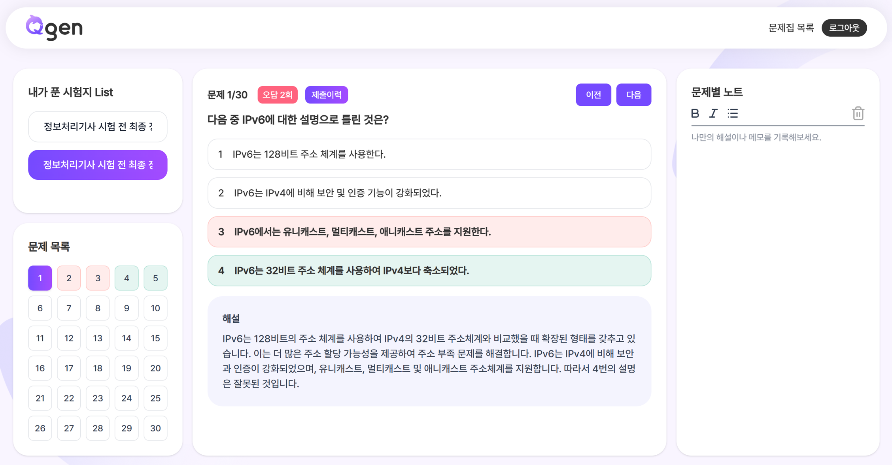

# 1. 프로젝트 개요

### 📋 서비스 개요
- RAG 기반 문제 생성 서비스
- RAG를 활용하여 사용자가 입력한 데이터를 기반으로 유사도 검색을 하여 정밀한 문제를 생성해주는 서비스 입니다. 
- **프로젝트 기간:** 2025/4/14 ~ 2025/5/21 
<br>


### 💡 서비스 특징

#### 1. 문서/자료 업로드 기반 AI 문제 생성
사용자는 PDF, DOCX, 텍스트 등 다양한 형태의 학습 자료를 업로드할 수 있습니다.
링크를 넣어 링크 내 사이트를 자동으로 크롤링하여 데이터를 입력할 수 있습니다. 
업로드된 자료를 바탕으로 AI가 자동으로 맞춤형 문제를 생성합니다.

#### 2. 문제집/시험지 관리
여러 개의 문제집을 생성하고, 각 문제집 내에서 시험지를 체계적으로 관리할 수 있습니다.
시험지별로 문제 유형(객관식, 주관식, OX )과 문제 수를 자유롭게 설정할 수 있습니다.

#### 3. 실시간 학습 이력 및 피드백
문제 풀이 결과와 학습 이력을 실시간으로 저장 및 확인할 수 있습니다.
오답노트, 풀이 기록 등 다양한 피드백 기능을 제공합니다.

#### 4. 직관적인 가이드 및 도움말
서비스 이용이 처음인 사용자도 쉽게 적응할 수 있도록 단계별 가이드 모달을 제공합니다.
언제든지 오른쪽 하단의 가이드 버튼을 통해 도움말을 확인할 수 있습니다.

#### 5. 학습 몰입도 향상을 위한 디자인
차분한 컬러와 친근한 캐릭터(돌고래 등)로 직관적인 UI를 구성하여 학습 몰입도 향상
<br>
<br>

# 2. 설계 및 구현

## 🛠 기술 스택

### Frontend <br>


### Backend <br>


### AI <br>


### DevOps <br>


### Tools <br>


<br>

### 🖼️아키텍쳐 설계

<br>

### 💾데이터베이스 모델링(ERD)

<br>

### 🎨화면 정의서(Figma)
[Figma_화면정의서](https://www.figma.com/design/oSophIoTs9EkVTZZxBGch4/Q-gen?node-id=17-2&t=RTytrBLmL8te7ydv-0)

<br>

### 📝요구사항 정의서
[Notion_요구사항 정의서](https://ubiquitous-theory-103.notion.site/1dc0e945fc098095a082cffb49d8a7b3?pvs=4)

<br>

### 📄API명세서

[Notion_API명세서](https://ubiquitous-theory-103.notion.site/API-1de0e945fc0980d5b553f298e558ac68?pvs=4)

<br>

### 🗂️프로젝트 폴더 구조

**Frontend** - Yarn Berry + Vite + React + Typescript

```text
frontend/
└── src/
    ├── App.tsx
    ├── App.css
    ├── hooks/
    │   └── useAuth.ts
    ├── components/
    │   ├── layout/
    │   │   ├── Header/
    │   │   │   └── Header.tsx
    │   │   ├── Footer/
    │   │   │   └── Footer.tsx
    │   │   └── Background/
    │   │       ├── ArcBackground.tsx
    │   │       └── BlurBackground.tsx
    │   ├── Scroll/
    │   │   └── ScrollToTop.tsx
    │   ├── common/
    │   │   ├── PCRecommendModal/
    │   │   │   └── PCRecommendModal.tsx
    │   │   ├── StickyGuideButton/
    │   │   │   └── StickyGuideButton.tsx
    │   │   └── GuideModal/
    │   │       └── GuideModal.tsx
```

**Backend** - Spring Boot

```text
server
├── src.main.java.com.s12p31b204.backend
│   ├── config
│   ├── contoller
│   ├── domain
│   ├── dto
│   ├── exception
│   ├── filter
│   ├── oauth2
│   ├── repository
│   ├── service
│   ├── util
├── src.main.resources
│   ├── fonts
│   ├── images
│   ├── templates
│   ├── aplication.yml
```

**AI**
```test
ai/
└── app/
    ├── health_check
    │   └── health_check.py
    ├── problem_generator_py
    │   ├── chatgpt.py
    │   └── prompt.py
    ├── rag/
    │   ├── model/
    │   │   └── s3_request.py
    │   ├── prompt/
    │   │   └── prompt.py
    │   ├── service/
    │   │   ├── embedding.py
    │   │   ├── extract.py
    │   │   ├── generate.py
    │   │   └── search.py
```

# 3. 서비스 주요 화면
## 1. 메인 화면 
### 1) Section 1


### 2) Section 2 

### 3) Section 3

### 4) Header / Footer


## 2. 문제집/시험지 리스트 페이지


## 3. 문제 생성 페이지


## 4. 문제 노트 페이지


## 5. 문제 풀기 페이지


<br>

# 4. 기능 상세 설명

## 🚪Front-End

- 개발환경: YarnBerry + Vite + React + Tyepscript
- 디자인 패턴: Atomic Design + FSD Structure
- API 통신: Axios
- 상태 관리: Zustand
- 데이터 캐싱 관리: React-Query
- API Mocking Library: MSW
- UI Test: StoryBook
- Tailwind CSS

## ✅ 문제집/시험지/자료 관리
### 1️⃣ 문제집 목록 및 관리
WorkBookList 컴포넌트 구현
WorkBook 타입을 활용한 문제집 데이터 관리
최신순/제목순 정렬 기능 (커스텀 드롭다운 컴포넌트 활용)
문제집 추가, 수정, 삭제 기능 (Swal 모달로 UX 통일)
각 문제집 클릭 시 상세 페이지로 이동

### 2️⃣ 문제집 상세 및 시험지 관리
List 페이지(메인)
문제집 선택 시 해당 문제집의 시험지 리스트(TestPaperList)와 자료 업로드(UploadedList) 동시 표시
시험지 생성, 삭제, PDF 변환, 문제 노트 이동 등 다양한 액션 지원
시험지 생성 중에는 로딩 애니메이션(CreatingLoader) 표시

### 3️⃣ 시험지 리스트 및 상세
TestPaperList 컴포넌트
시험지별 제목, 생성일, 문제수, 문제유형 등 정보 표시
한 줄 ellipsis 및 hover 시 전체 제목 툴팁/스크롤 애니메이션 지원
시험지 삭제 시 Swal 확인 모달 적용
시험지 생성, 문제 풀기, PDF 변환, 문제 노트 이동 등 액션 버튼 제공

### 4️⃣ 자료 업로드 및 미리보기
UploadedList 컴포넌트
업로드된 파일 리스트, 진행률, 파일 삭제 기능
PDF, DOCX 등 미리보기 지원 (mammoth, PDF.js 등 활용)
파일 타입별 아이콘 및 사용자 친화적 타입명 표시
파일 업로드 시 유효성 검사(확장자, 크기 등)

## ✅ 문제 생성 페이지
### 1️⃣ 시험지 생성 기본 정보
시험지 제목 관리
자동 번호 부여 시스템 (문제집명 + 순차적 번호)
최대 100자 제한 및 실시간 글자수 표시
커스텀 입력 필드 (placeholder 활용)

### 2️⃣ 문제 유형 및 수량 설정
문제 유형 선택 (ProblemTypeSelector)
객관식, 주관식, OX퀴즈 3가지 유형 제공
각 유형별 문제 수량 조절 (0-30개)
총 문제 수 실시간 표시 및 30개 제한
유형별 토글 및 수량 조절 UI

### 3️⃣ 학습 자료 관리
파일 업로드 시스템 (FileUploader)
드래그 앤 드롭 지원
링크/텍스트 직접 입력 기능
업로드 진행률 표시
파일 타입별 유효성 검사
업로드된 자료 관리 (UploadedList)
최대 30개 파일 제한
파일 선택/해제 기능
파일 삭제 기능


## ✅ 문제 노트 페이지
### 1️⃣ 시험지 목록 관리
시험지 리스트 (TestList)
최신순 정렬 (reverse() 적용)
SimpleBar를 활용한 스크롤 최적화
시험지 제목 자동 스크롤 애니메이션 (ScrollingEllipsis)
현재 선택된 시험지 하이라이트 효과
### 2️⃣ 문제 상세 보기
문제 유형별 렌더링
객관식 (TYPE_CHOICE)
주관식 (TYPE_SHORT)
OX퀴즈 (TYPE_OX)
각 유형별 맞춤형 UI/UX 제공
문제 정보 표시
문제 번호 및 전체 문제 수
문제 내용
선택지 (객관식/OX퀴즈)
정답 및 해설
오답 횟수 표시
### 3️⃣ 학습 이력 관리
문제 풀이 이력
사용자 답안 기록
제출 시간 기록
정답/오답 여부 표시
이력 타임라인 표시
메모 기능
문제별 메모 작성/수정
실시간 저장
메모 히스토리 관리
### 4️⃣ 네비게이션 기능
문제 이동
이전/다음 문제 이동
문제 번호 직접 선택
시험지 간 이동
URL 파라미터 기반 라우팅

## ✅ 문제 풀기 페이지
### 1️⃣ 문제 풀이 인터페이스
문제 프레임 (QuestionFrame)
현재 문제 번호 및 전체 문제 수 표시
문제 내용 표시
선택지 렌더링 (객관식/OX퀴즈)
제출/다음 버튼
해설 및 정답 표시
### 2️⃣ 문제 유형별 처리
문제 유형 지원
객관식 (choiceAns)
주관식 (shortAns)
OX퀴즈 (oxAns)
각 유형별 맞춤형 UI/UX
### 3️⃣ 답안 관리 시스템
답안 상태 관리
선택된 답안 저장
제출 상태 관리
정답/오답 상태 관리
답안 이력 관리
답안 제출 프로세스
답안 유효성 검사
서버 제출 처리
결과 즉시 표시
오답 노트 자동 저장
### 4️⃣ 사이드바 기능
ExamSidebar 컴포넌트
전체 문제 목록 표시
현재 진행 상태 표시
문제별 상태 표시 (미풀이/정답/오답)
문제 번호 직접 선택 기능


## ✅ 가이드/접근성/UX
### 5️⃣ PC 권장 모달
PCRecommendModal 컴포넌트
모바일 환경에서만 최초 1회 노출 (localStorage로 상태 관리)
"계속하기" 클릭 시 localStorage에 저장, 이후 노출 안 됨

### 6️⃣ 서비스 가이드 모달
GuideModal 컴포넌트
슬라이드 방식의 단계별 가이드(이미지+텍스트)
"다시 보지 않기" 체크 시 localStorage에 저장, 이후 노출 안 됨
오른쪽 하단 StickyGuideButton 클릭 시 토글로 열고 닫기 가능
특정 페이지에서만 버튼 노출(경로 조건부 렌더링)

### 7️⃣ 스크롤/접근성
ScrollToTopButton 컴포넌트
스크롤 200px 이상 시 우측 하단에 부드럽게 등장
클릭 시 페이지 최상단으로 스크롤 이동

## ✅ 기타 공통 컴포넌트 및 유틸
### 8️⃣ 공통 버튼/아이콘/입력
Button, IconBox, InputField 등
일관된 디자인과 재사용성 확보

### 9️⃣ 상태/스토어/훅
useWorkBook, useTestPaper, useDocuments, useAuth 등
데이터 패칭, 인증, 상태 관리 등 커스텀 훅으로 분리

<br>

---
## 👜 Back-End
- 개발환경: Spring Boot + JPA + Spring Security + Lombok
- 데이터베이스: MySQL
- API 통신: WebFlux
- 로그인: OAuth2 + JWT
- PDF 변환: ThymeLeaf + OpenHtmlToPdf

## ✅ 회원 관리
### 1️⃣ 구글 로그인
OAuth2를 이용한 구글 로그인 구현
SuccessHandler를 커스텀하여 리다이렉션

### 2️⃣ JWT 토큰 발급 및 인증/인가
JWT를 도입하여 Access Token 발급
Filter를 이용한 로그인 검증
인증 전용 Service로 데이터 읽기 및 쓰기 시 권한 확인

## ✅ 문제집/시험지/자료/문제노트 관리
### 3️⃣ 문제집 생성 및 조회
WorkBookController/Service/Repository 구현
문제집 생성, 전체 조회, 상세 조회, 삭제, 제목 수정 기능

### 4️⃣ 자료 업로드 및 Parsing/Chunk화

### 5️⃣ 시험지 생성 및 조회

### 6️⃣ 문제 조회 및 풀이, 이력 저장

### 7️⃣ 문제 노트 조회 및 메모 저장

### 8️⃣ 시험지 PDF 변환

### 9️⃣ 유저별 SSE 연결 관리

<br>

---
## 🤖 AI
- 개발환경: FastAPI
- 벡터DB: Faiss

## ✅ 기능 제목 
### 1️⃣ 부기능 제목
WorkBookList 컴포넌트 구현
WorkBook 타입을 활용한 문제집 데이터 관리
최신순/제목순 정렬 기능 (커스텀 드롭다운 컴포넌트 활용)
문제집 추가, 수정, 삭제 기능 (Swal 모달로 UX 통일)
각 문제집 클릭 시 상세 페이지로 이동

---
## 🏰 Infra
- 웹서버: NginX
- 실행환경: Docker, Docker-compose
- CI/CD: Jenkins
- 배포: AWS EC2
- 코드리뷰: SonarQube

## ✅ 기능 제목 
### 1️⃣ 부기능 제목
WorkBookList 컴포넌트 구현
WorkBook 타입을 활용한 문제집 데이터 관리
최신순/제목순 정렬 기능 (커스텀 드롭다운 컴포넌트 활용)
문제집 추가, 수정, 삭제 기능 (Swal 모달로 UX 통일)
각 문제집 클릭 시 상세 페이지로 이동

## ✅ 배포 환경 구축 
### 1️⃣ 웹서버
- **NGINX**
  - `HTTPS`를 적용하고 여 사이트의 보안 향상.
  - Blue-Green 무중단 배포로 서비스 연속성 구현

### 2️⃣ 배포 환경 구축과 CI/CD
- **Docker, Docker-compose**
  - `docker`를 이용하여 실행환경을 컨테이너화.
  - 배포에 사용되는 컨테이너를 `docker-compose`로 묶어서 배포.

- **Jenkins**
  - Docker에서 Jenkins image를 pull 받아서 실행
  - 파이프라인 스크립트를 작성하여 배포

- **AWS EC2**
  - 제공받은 AWS EC2 사용

- **Runpod GPU**
  - Runpod에서 GPU 서버를 받아서 임베딩, 리랭커 등에 활용 

- **SonarQube**
  - 소나큐브 구축으로 리팩터링에 활용

<br>

# 5. 한줄 소감
**🟥 구민석**

**🟨 이신욱** : 사용자 피드백을 통해 더 나은 서비스를 만들어가는 과정이 재밌고 뿌듯했습니다. 무엇보다 여러 어려운 문제들을 포기하지 않고 함께 해결해 나간 팀원들에게 감사했던 프로젝트였습니다. 


**🟩 최현만** : 인프라나 AI에서 기술적인 도전을 극복하는 과정이 재미있었습니다. 좋은 팀원들과 함께할 수 있어서 값진 경험이었습니다. 감사합니다.


**🟦 장인영**


**🟪 홍정표** : 포지션에 구애받지 않고 같은 고민을 함께 나누고 해결하는 과정이 굉장히 뜻깊고 즐거웠습니다. 좋은 경험을 준 팀원들에게 감사드립니다. 괜찮으면 또 같이해요!


**🟧 황연주** : 처음해보는 기술 도전과 기획, 그런 만큼 쉽지 않은 과정이었지만 4321이라서 할 수 있었고 그래서 더 의미가 큰 것 같아요. 다들 감사합니다. 


